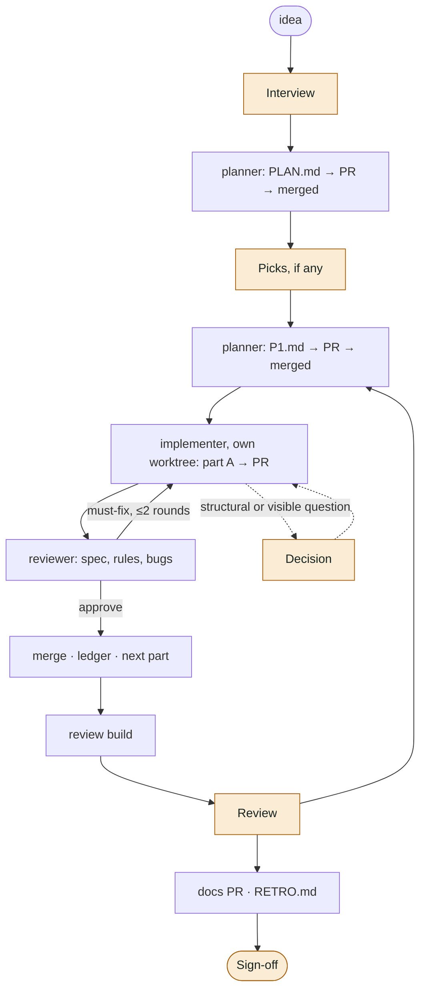

# conductor

A Claude Code plugin for solo projects where your time should go into **ideas, look-and-feel and sign-off**, not into session admin.

You open one session per feature and run `/conductor:feature <idea>`. Claude interviews you, then coordinates subagents that plan, build, review and merge the work through pull requests. It only comes back to you at five typed stops:

| Stop | What you do |
|---|---|
| **Interview** | Answer a few multiple-choice rounds about the idea |
| **Pick** | Choose between visual variants on a gallery page |
| **Decision** | Settle something that changes what you'd see or feel, or that can't be undone |
| **Review** | Try the build (on a device, in a browser) and say "ok" or what's off |
| **Sign-off** | Confirm the feature is done |

There are no "should I continue?", "is the plan ok?" or "is this phase done?" check-ins.

## How it works



- **The coordinator** is your session. It reads only plans, the ledger and short worker reports, so its context stays small for the whole feature.
- **planner** (Opus) writes `PLAN.md` and one `P<n>.md` per phase. It decides internal questions itself and lists the visible ones for you.
- **implementer** (Sonnet, its own git worktree) builds one part: commits per step, runs the project's verify command, opens a PR.
- **reviewer** (Sonnet, read-only) checks the PR against the phase plan, the project's rules and correctness.
- **`.conductor/ledger.md`** (git-ignored) records every event, so a `/clear`, a compaction, a `/conductor:break` or a new session picks up exactly where it stopped.
- **One coordinator session per phase.** After you say "ok" on a phase review, conductor asks you to `/clear` and run `/conductor:feature` again. The ledger carries everything over, and the next phase starts small instead of re-reading the last one's history on every turn.
- **Token budget.** The coordinator reads only reports and the ledger, never whole plans or code. Workers get only the tools they need, trim command output and downscale screenshots. `skills/feature/scripts/usage.py <slug>` reports where a feature's tokens went, and the retro includes it.

Projects describe themselves once, in a `## Pipeline` section of their CLAUDE.md (`/conductor:setup` writes it): the verify command, how to make a review build, where plans live, the commit style, and which areas parts must not touch.

## Install

```bash
claude plugin marketplace add LennSchneidewind-67548/conductor
claude plugin install conductor@conductor
```

Then, in a project: `/conductor:setup` once, and `/conductor:feature <idea>` per feature. `/conductor:status` shows where things stand.

To save usage for other work, run `/conductor:break` in the coordinator session. It starts nothing new, lets the running worker finish, saves state to the ledger (review findings go on the PR as a comment), and tells you when it's safe to close. `/conductor:feature` in a fresh session picks up from there.

It works best in auto mode, with `gh` authenticated and a project verify command that's trustworthy enough to merge on.

## Design notes

conductor is small on purpose. It borrows the parts of larger frameworks that fit a one-person, one-stream workflow, and leaves out the rest.

| Idea | Borrowed from |
|---|---|
| Classify the request (spike / bounded / feature) before asking; write back "you said / I assume" | [Superpowers](https://github.com/obra/superpowers) brainstorming |
| Fresh subagent per unit, a four-value status contract, an on-disk ledger, a cap on fix rounds, and "rulings, not stalls" | Superpowers subagent-driven development |
| Gray areas become locked decisions that later agents can't reopen | [GSD Core](https://github.com/open-gsd/gsd-core) discuss phase |
| Deviation rules: fix bugs, correctness gaps and blockers; stop for structural changes; never add a package without asking | GSD executor |
| Write down a lesson only if it would otherwise be lost | [Compound Engineering](https://github.com/EveryInc/compound-engineering-plugin) `ce-compound` |

Left out on purpose: mandatory TDD, a review agent per task, persona agents, approval gates between phases, and parallel streams. These are good at team scale; for a personal project they cost more tokens and more of your attention than they save.

Every feature ends with a `RETRO.md` whose "Improve conductor" list feeds back into this repo.

## License
MIT
